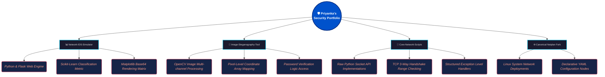

## 📂 Featured System Engineering Repositories

```mermaid
graph TD
    %% Custom Styling Theme Definitions Parameters Check Layout Design
    classDef core fill:#0052cc,stroke:#002b80,stroke-width:3px,color:#fff,font-weight:bold;
    classDef nodeStyle fill:#1a1a2e,stroke:#00b4d8,stroke-width:2px,color:#e0e0e0,font-size:12px;
    classDef toolStyle fill:#162447,stroke:#e94560,stroke-width:1.5px,color:#ff9f89,font-style:italic;

    %% Central Node Identification Framework Mapping Coordinates
    Center((🛡️ Priyanka's<br>Security Portfolio)):::core

    %% Project Branch 1: Real-Time Network IDS Simulator Dashboard
    Center --> Project1[📊 Network-IDS-Simulator]:::nodeStyle
    Project1 --> P1_Tool1(Python & Flask Web Engine):::toolStyle
    Project1 --> P1_Tool2(Scikit-Learn Classification Metric):::toolStyle
    Project1 --> P1_Tool3(Matplotlib Base64 Rendering Matrix):::toolStyle

    %% Project Branch 2: Image Steganography Utility Tool
    Center --> Project2[🔑 Image-Steganography-Tool]:::nodeStyle
    Project2 --> P2_Tool1(OpenCV Image Multi-channel Processing):::toolStyle
    Project2 --> P2_Tool2(Pixel-Level Coordinate Array Mapping):::toolStyle
    Project2 --> P2_Tool3(Password Verification Logic Access):::toolStyle

    %% Project Branch 3: Lightweight Socket Port Scanner
    Center --> Project3[🔌 Core-Network-Scripts]:::nodeStyle
    Project3 --> P3_Tool1(Raw Python Socket API Implementations):::toolStyle
    Project3 --> P3_Tool2(TCP 3-Way Handshake Range Checking):::toolStyle
    Project3 --> P3_Tool3(Structured Exception Level Handlers):::toolStyle

    %% Project Branch 4: Infrastructure Foundation Layer Netplan
    Center --> Project4[🌐 Canonical Netplan Fork]:::nodeStyle
    Project4 --> P4_Tool1(Linux System Network Deployments):::toolStyle
    Project4 --> P4_Tool2(Declarative YAML Configuration Nodes):::toolStyle
```
